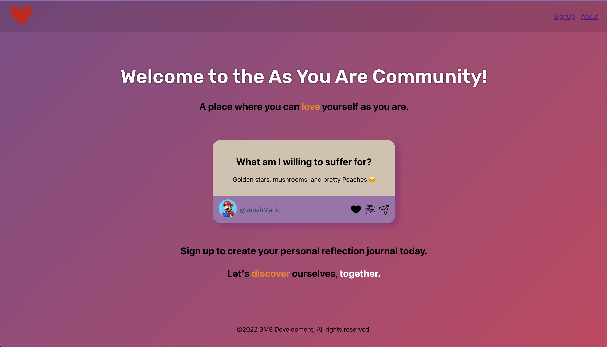

As You Are Reflection Journal

## Link to App

https://asyouare.herokuapp.com/

## Description

This app is something I've been wanting to create for a long time and it's manifestation is the culmination of everything I've learned about software development so far.

So much of self-love is dependent on self-awareness and the overall goal of this app is to grow self-love by increasing self-awareness.

The general idea is to have a place where you can be prompted to answer and write about meaningful questions that will allow you to gain a deeper understanding of yourself.

The app is still in the early stages of development but over time it will evolve into a fully featured social self-discovery app. 

## Images

App Landing Page

## Tech Stack
    - React.js
    - Express.js
    - Node.js
    - Javascript
    - Draft.js (framework for text editor)
    - CSS 
    - HTML 
    

## Upcoming Features
- User profile pages
- User journals page
- Self-awareness Assessments
- Ability to like, comments, & share public posts
- Ability to search prompts
- Ability to follow users and prompts
- Feed page curated by user options
- Mobile Responsiveness
- Account setting's portal
- Dark * Light Themes

## Known Issues
    - app doesn't redirect to home automatically after signup

This section has moved here: [https://facebook.github.io/create-react-app/docs/troubleshooting#npm-run-build-fails-to-minify](https://facebook.github.io/create-react-app/docs/troubleshooting#npm-run-build-fails-to-minify)
